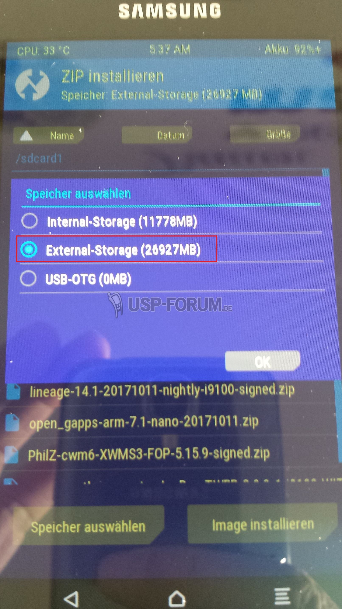
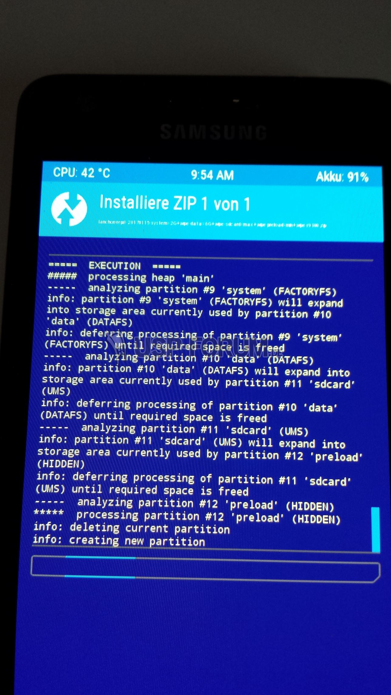

### Preliminary Information
In addition to various files that you have to download, you will also have to change the file system of the Galaxy S2. 

As you know, the Galaxy S2 didn't have too much memory. In particular, the memory for the system was very limited at 512 MB. For the Android versions up to KitKat, the whole thing was still sufficient. Starting with Android Lollipop, things got pretty tight because not only the Android version but also the standard Google Apps are installed in the system partition. Since Android Marshmallow there is no longer enough space.

Therefore, you not only have to flash [Lineage OS](https://download.lineageos.org/i9100), but also change the partition size beforehand. The use of a MicroSD card is definitely helpful here with the Galaxy S2 - especially after installing Lineage OS - because the "enlargement" of the system partitions means that the total memory available is smaller.

**Attention:** I am assuming with these instructions that an original Samsung firmware Android 4.1.2 is installed on the Galaxy S2 and that its data, if it is still being used, is backed up in advance. If you have already installed a Custom Rom on your Galaxy S2, you may have to do it differently.

### Prerequisites
To install Lineage OS v14.1, all of the following files must be copied to the MicroSD card that you will insert into the Galaxy S2:
- [Lineage OS](./bin/lineage-14.1-20181216-nightly-i9100-signed.zip). *Attention: at lineageos.org support for the Galaxy S2 i9100 is no longer available. I cannot say at the moment whether this will happen again in the future or whether Lineage has stopped further development. We have therefore downloaded the last Nightly from December 16 2018.* For further versions you have to either go via the built-in update function (to be found in the settings) or you check out the XDA forum from time to time.
- [Gapps](https://opengapps.org/) (Google Apps) The Open GApps Project (ARM / Android 7.1 / desired variant - I prefer [Nano](open_gapps-arm-7.1-nano-20200502.zip) to maximum Mini, because everything else on Google Apps can be installed from the Play Store)
- If you want to root, you still need the [SU Addon](addonsu-14.1-arm-signed.zip) (Version 14.1 in the ARM variant), because there is no root in Lineage.
- [PhilzTouch Recovery 5.15.9](./bin/PhilZ-cwm6-XWMS3-FOP-5.15.9-signed.zip)
- [Lanchons IsoRec Kernel](./bin/kernel-Lanchon-20160406-cm-13.0-i9100.zip)
- [The Gangsters TWRP](./bin/recovery-the.gangster-IsoRec-TWRP-3.0.2-1-i9100-WITH-PRELOAD-SUPPORT.zip)
- [Lanchons script for changing the partitions](lanchon-repit-20170115-system=2G+wipe-data=6G+wipe-sdcard=max+wipe-preload=min+wipe-i9100.zip)

Now comes the preparatory work. For this you should definitely use a MicroSD card in the Galaxy S2. First of all, the downloaded files should be copied to the MicroSD card, because the memory of the Galaxy S2 must definitely be completely deleted during the installation.

**Attention:** don't change the name of the name of the Lanchons script file. The partitioning is changed using the name of the file.

**Explanation:**
- `system=2G+wipe` (extends the system size to 2 GB and at the same time deletes the current content - standard would be 0.5 G = 512 MB)
- `data=6G+wipe` (extends the data partition to 6 GB and simultaneously deletes the current content - standard is 2 G = 2 GB)
- `sdcard=max+wipe` (makes the rest of the built-in memory - not to be confused with an additional micro SD card - available to the system and at the same time deletes the current content - standard is = max)
- `preload=min+wipe` (the Prelaod partition is not used with Lineage and can therefore be reduced to the smallest possible size - 8 MB - so that you have a little more space for the data partition - the default here is 0.5 G = 512 MB).

If you want, you can of course also take a smaller size. Because the size I prefer is the maximum that you should take with the Galaxy S2. Here is another example of a smaller partitioning:

`lanchon-repit-20170115-system=1.5G+wipe-data=4G+wipe-sdcard=max+wipe-preload=min+wipe-i9100.zip`. So later you would not only have about 6 GB as an internal SD card, but 8.5 GB.

### Instructions
Boot the Galaxy S2 in recovery mode. To do this, press and hold the `Volume Up` + `Home` + `Power` simultaneously until the Android logo appears.

Use the volume keys to navigate to the `apply update from external storage` item and confirm with the power button. Now navigate to `PhilZ-cwm6-XWMS3-FOP-5.15.9-signed.zip` and confirm with the power button. The Philz Recovery should now be loaded.

Now navigate back to `../` and confirm. Here you have to select the item `reboot system now`. After restarting the Galaxy S2, it must be switched off again and restarted in recovery mode. If your Galaxy S2 gets stuck at this point (happened during my test attempts), simply remove the battery briefly, insert it again and start in recovery mode. The recovery menu now looks very different.

First go to the `Backup and Restore` item and select `Custom Backup and Restore` and then `Custom Backup Job`. At this point you can choose which points should be saved. I personally use the items `Backup boot`, `Backup recovery`, `Backup system`, `Backup data`, `Backup Cache` and `Backup modem`. Finally, click `Start Custom Backup Job`. Now select `Backup to External sdcard`.

In a second step, go to the `Custom Backup Job` menu again and only select the `Backup EFS` item. Here again select `Start Custom Backup Job` and `Backup to external sdcard`. Unfortunately, you have to do this separately, as there is no way to back up both together with this recovery. Now that you have saved everything, go back to the beginning via the menu item `Go Back`. Here select `Wipe Data / Factory Reset`. On the next page, select `Wipe Data / Factory Reset` again and then navigate to `Yes` and confirm. When that's done, go back to the home page.

Select `Install Zip` in the start menu. Here we first flash the downloaded ISO Rec Kernel, ie `kernel-Lanchon-20160406-cm-13.0-i9100.zip` and then the file `recovery-the.gangster-IsoRec-TWRP-3.0.2-1-i9100-with-preload-support.zip`.

To do this, select `Choose zip from sdcard` and first install `kernel-Lanchon-20160406-cm-13.0-i9100.zip`. In the second step, select `Choose zip from sdcard` again and select `recovery-the.gangster-IsoRec-TWRP-3.0.2-1-i9100-with-preload-support.zip`. After flashing these two files go back to the start menu page and click `Reboot System Now`. The Galaxy S2 should now start directly in recovery, but in the TWRP recovery that we just installed. If your Galaxy S2 gets stuck at this point again (happened during my test attempts), simply remove the battery briefly, insert it again and manually start in recovery mode.

Here, first go to `Select Language` and set it to your language of choice.

Then, you will be asked if you want to `Keep System Read only`. **Don't** select this. Instead, allow TWRP access to system modifications by swiping right. 
Now are you are good to go with the flashing.

By keeping the system as read only, you tell TWRP that you will never touch the files on the system, which means that the only thing you will be able to do will be a factory reset, which ultimately beats the purpose of flashing a custom recovery on the phone. Instead, since you are planning to flash a custom ROM, you have to allow TWRP access to system modifications. Now are you are good to go with the flashing.

If you accidentally clicked on `Keep System Read only`, in the recovery menu go to `Mount`. You will find a list of optins. Untick `Mount system partition read-only`. That should solve it.

At this point one may ask why we first installed Philz Recovery to install the TWRP recovery instead of immediately installing the TWRP recovery. This is because the IsoRec kernel had to be flashed before the TWRP recovery. Only then can the TWRP Recovery be installed, otherwise it would not work correctly.

Now comes the most important part, because to be able to install Lineage OS you have to adapt the file system of the Galaxy S2.

There is also a possibility to change the partitioning via a .pit file with Odin, but I find the variant presented here with Lanchon's script much easier and above all, you can do everything via TWRP. So you can continue with Lineage and the rest immediately after changing the partition.

Click on `Install`. Click on `Select Storage` and switch to `External Storage`, because that is the Micro SD card used.

Select `lanchon-repit-20170115-system=2G+wipe-data=6G+wipe-sdcard=max+wipe-preload=min+wipe-i9100.zip` (or however you changed the file name). Simply tap on the file and in the next window move the slider (`Swipe to confirm Flash`) from left to right. For many, an error may now arise because something did not fit when mounting sdcard1. This is not a problem, because the installation file has now been automatically saved to a tmp folder in the system partition.

For this we go back one step using the lower screen buttons so that we are back in the file overview of the Micro SD card. Here we click on `(Up A Level)` above, until we are in the root folder. Scroll down here, to the `tmp` folder and tap it once. Now you should see our installation script again. Tap this. Now confirm the installation again and the script should run without an error message. Once it says `done` below, click `Wipe cache/dalvik` and swipe to confirm. go back one step using the lower screen buttons and go to the root folder. Select `sdcard1` and you are back to the file overview with our copied files.

Here first tap on `lineage-14.1-20181216-nightly-i9100-signed.zip`. In the next window, select `Add more zips` and tap on `open_gapps-arm-7.1-nano-20200502.zip`.

If you also want to have root access, select `Add more zips` again and then select the `addonsu-14.1-arm-signed.zip` file.

The last thing to do is to swipe to confirm flash again to flash the selected files. After all files have been flashed, the message `done` appears again. Here you should definitely select the `Wipe cache/dalvik`. Only then you should `Reboot System`. 

Lineage OS 14.1 should now start. The start-up process takes a little time the first time.

## Post Installation
**Note:** Lineage OS is still being developed for the Galaxy S2 i9100. In each version there may be errors or functions not included.

To activate Root, you first have to go to `Settings`, `About phone` and tap the `Build number` 7 times so that the developer options are activated. 
You will find the `Developer options` item in `Settings` directly above `About phone`. Open the `Developer options` and scroll down to `Root access`. Tap once and select the one you want. I have `Apps and ADB`.

Since you are already there, you can also activate `Android Debugging` (a.k.a. USB debugging) and `Advanced restart`.

Use the MicroSD card in the system as `internal storage` and not as mobile storage (to use the SD card in other devices or card readers), because only in this way is there enough memory in the Galaxy S2 to be able to use it really well. But be careful, back up the files that are on the SD card, because when connecting to the internal memory, the data on it might be deleted.